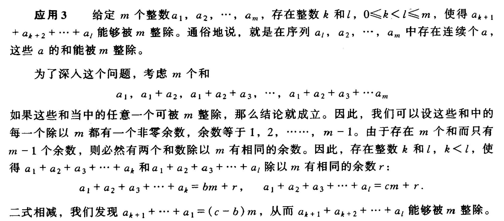

# 背包类问题

> **01背包（ZeroOnePack）:** 
> 有N件物品和一个容量为V的背包。（每种物品均只有一件）第i件物品的费用是c[i]，价值是w[i]。求解将哪些物品装入背包可使价值总和最大。
> **完全背包(CompletePack):**
> 有N种物品和一个容量为V的背包，每种物品都有无限件可用。第i种物品的费用是c[i]，价值是w[i]。求解将哪些物品装入背包可使这些物品的费用总和不超过背包容量，且价值总和最大。
> **多重背包(MultiplePack):**
> 有N种物品和一个容量为V的背包。第i种物品最多有n[i]件可用，每件费用是c[i]，价值是w[i]。求解将哪些物品装入背包可使这些物品的费用总和不超过背包容量，且价值总和最大。
> 比较三个题目，会发现不同点在于每种背包的数量，01背包是每种只有一件，完全背包是每种无限件，而多重背包是每种有限件。

模板:

c是重量，w是价值，n是个数

```cpp
void bag01(int c,int w)
{
    for(int i=v; i>=c; i--)
        dp[i]=max(dp[i],dp[i-c]+w);
}
void bagall(int c,int w)
{
    for(int i=c; i<=v; i++)
        dp[i]=max(dp[i],dp[i-c]+w);
}
void multbag(int c,int w,int n)
{
    if(c*n>=v)
    {
        bagall(c,w);
        return;
    }
    int k=1;
    while(k<=n)
    {
        bag01(k*c,k*w);
        n-=k;
        k*=2;
    }
    bag01(n*c,n*w);
}
```

用法:

先循环每一件物品的各个属性，最后dp[v]的值就是答案

以多重背包为例

```cpp
const int N=50000+10;
int dp[N],v;
int num[N],weight[N],value[N];
void bag01(int c,int w)
{
    for(int i=v; i>=c; i--)
        dp[i]=max(dp[i],dp[i-c]+w);
}
void bagall(int c,int w)
{
    for(int i=c; i<=v; i++)
        dp[i]=max(dp[i],dp[i-c]+w);
}
void multbag(int c,int w,int n)
{
    if(c*n>=v)
    {
        bagall(c,w);
        return;
    }
    int k=1;
    while(k<=n)
    {
        bag01(k*c,k*w);
        n-=k;
        k*=2;
    }
    bag01(n*c,n*w);
}
int main()
{
    int n,m;
    scanf("%d%d",&n,&v);
    for(int i=1; i<=n; i++)
    {
        scanf("%d%d%d",&weight[i],&value[i],&num[i]);
    }
    for(int i=1; i<=n; i++)
        multbag(weight[i],value[i],num[i]);
    printf("%d\n",dp[v]);
    return 0;
}
```

zb的生日dp:

把一堆物品分成两堆，每个物品有自己的重量，最后使得两堆的差值最小.

```cpp
//dp[v]:为其中一个人获得的重量，sum-dp[v]为另一个人重量,dp数组开的大一点
int sum = 0;
for (int i = 0; i < n; i++)
{
    scanf("%d", &a[i]);
    sum += a[i];
}
int v = sum / 2;
for (int i = 0; i < n; i++)
    for (int j = v; j >= a[i]; j--)
        dp[j] = max(dp[j], dp[j - a[i]] + a[i]);
```


POJ 3260 The Fewest Coins

题意：最小货币流通：用面值Vi，个数Ci的硬币购买价格T的商品，假设商店每种面值的硬币都有无限个，求最小货币流通量。

**双端队列** ：流通分为付钱和找钱两个过程，定义两个过程分别需要的硬币数为如下dp数组：

```C++
    int dp_change[MAX_T + MAX_V * MAX_V];   // dp_change[i] := 商店找钱金额为i时最少硬币数
    int dp_pay[MAX_T + MAX_V * MAX_V];      // dp_pay[i] := 顾客付钱金额为i时最少硬币数
```

那么最终答案为两个硬币数之和的最小值：

```
    for (int i = max_v * max_v; i >= 0; --i)
    {
        ans = min(ans, dp_change[i] + dp_pay[T + i]);
    }
```

上面付出了T+i金额的钱，收回了i金额的钱，于是实际上就买到了价格T的商品。

问题大的框架就是这样，再来看怎么求解两个子过程的解。

**付钱阶段**:付钱阶段，每个硬币的携带量有限。将硬币视作物品，硬币的价格作为物品的重量，硬币的个数1作为物品的价值，则给定某个T作为背包容量W，问题转化为“物品价值总和最小”的多重背包问题。多重背包问题可以用书上的双端队列，也可以二进制分解转化为01背包问题，O(nWlog m)快速求解。

```C++
    // 多重背包转化为二进制的01背包
    void dp_multiple_pack(int n, int W)
    {
        memset(dp_pay, 0x3f, (W + 1) * sizeof(int));
        dp_pay[0] = 0;
        for (int i = 0; i < n; ++i)
        {
            int num = C[i];
            for (int k = 1; num > 0; k <<= 1)
            {
                int mul = min(k, num);
                for (int j = W; j >= V[i] * mul; --j)
                {
                    dp_pay[j] = min(dp_pay[j], dp_pay[j - V[i] * mul] + mul);   // 价值为1
                }
                num -= mul;
            }
        }
    }
```

**找钱阶段**：找钱阶段，硬币数量不限，在类似的思路下直接视作完全背包问题。

```
    // 完全背包
    void dp_complete_pack(int n, int W)
    {
        memset(dp_change, 0x3f, (W + 1) * sizeof(int));
        dp_change[0] = 0;
        for (int i = 0; i < n; ++i)
        {
            for (int j = V[i]; j <= W; ++j)
            {
                dp_change[j] = min(dp_change[j], dp_change[j - V[i]] + 1);  // "价值总和"最小
            }
        }
    }
```

**鸽笼原理**：题目的难点其实在于背包容量W的确定，W的意义为最优方案金额的最大值（上界）。

上述定义中频繁出现MAX_T + MAX_V * MAX_V，意味着，要凑足（大于等于）价格T的商品且硬币数最少，最多只能多给max_v  * max_v的金额（其中max_v为硬币的最大面值），称此上界为W。为什么会有这么紧的上界呢，假设存在一种最优支付方案，给了多于t  + max_v * max_v的钱，那么商店就会找回多于max_v *  max_v的钱，这些硬币的个数大于max_v。设这些硬币的面值分别为a_i，根据鸽笼原理的应用，硬币序列中存在至少两个子序列，这两个子序列的和分别都能被max_v整除。如果我们直接用长度更小的那个子序列换算为面值为max_v的硬币某整数个，再去替换母序列就能用更少的硬币买到商品，形成矛盾。

关于整除更详细的证明如下，尝试构造这样的子序列。长度为max_v+x的母序列至少可以找两个不同的长度为max_v的子序列出来，按照《组合数学》中的证明：



它们存在子序列可以被max_v整除。


```C++
    #include <iostream>
     
    using namespace std;
    const int MAX_T = 10000 + 4;
    const int MAX_N = 100 + 2;
    const int MAX_V = 120 + 1;
    const int INF = 0x3f3f3f3f;
     
    int N, T;
    int V[MAX_N], C[MAX_N];     // 面值和携带个数
    int max_v;                  // 最大面值
    int dp_change[MAX_T + MAX_V * MAX_V];   // dp_change[i] := 商店找钱金额为i时最少硬币数
    int dp_pay[MAX_T + MAX_V * MAX_V];      // dp_pay[i] := 顾客付钱金额为i时最少硬币数
     
    // 完全背包
    void dp_complete_pack(int n, int W)
    {
        memset(dp_change, 0x3f, (W + 1) * sizeof(int));
        dp_change[0] = 0;
        for (int i = 0; i < n; ++i)
        {
            for (int j = V[i]; j <= W; ++j)
            {
                dp_change[j] = min(dp_change[j], dp_change[j - V[i]] + 1);  // "价值总和"最小
            }
        }
    }
     
    // 多重背包转化为二进制的01背包
    void dp_multiple_pack(int n, int W)
    {
        memset(dp_pay, 0x3f, (W + 1) * sizeof(int));
        dp_pay[0] = 0;
        for (int i = 0; i < n; ++i)
        {
            int num = C[i];
            for (int k = 1; num > 0; k <<= 1)
            {
                int mul = min(k, num);
                for (int j = W; j >= V[i] * mul; --j)
                {
                    dp_pay[j] = min(dp_pay[j], dp_pay[j - V[i] * mul] + mul);   // 价值为1
                }
                num -= mul;
            }
        }
    }
     
    void solve()
    {
        dp_multiple_pack(N, T + max_v * max_v);     // 付钱
        dp_complete_pack(N, T + max_v * max_v);     // 找钱
        int ans = INF;
        for (int i = max_v * max_v; i >= 0; --i)
        {
            ans = min(ans, dp_change[i] + dp_pay[T + i]);
        }
        if (ans == INF)
        {
            ans = -1;
        }
        printf("%d\n", ans);
    }
     
    int main()
    {
    #ifndef ONLINE_JUDGE
        freopen("in.txt", "r", stdin);
    #endif
        scanf("%d%d", &N, &T);
        for (int i = 0; i < N; ++i)
        {
            scanf("%d", &V[i]);
            max_v = max(max_v, V[i]);
        }
        for (int i = 0; i < N; ++i)
        {
            scanf("%d", &C[i]);
        }
        solve();
    #ifndef ONLINE_JUDGE
        fclose(stdin);
    #endif
        return 0;
    }
```

