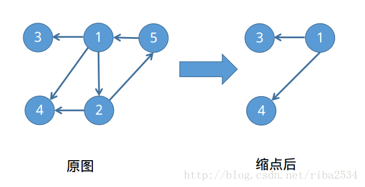

# 图的连通-tarjan算法

学习了一周**图的连通性问题**，现在总结一下关于图的连通性问题。图的连通性问题一般分为以下几种:

1. 无向图求关节点(割点)
2. 无向图求桥(割边)
3. 无向图的点双连通分量
4. 无向图的边双联通分量
5. 有向图求强连通分量

还需要注意一些v==fa的问题:

1. 强连通分量(不用判断)
2. 割点(不用判断)
3. 求**割边**或者**边双连通分量**的时候，用`flag`或者`i==fa^1`来去重边，在用`i==fa^1`的时候，需要注意在传参的时候要`tarjan(v,i)`而不是`tarjan(v,u)`
4. 强连通分量(不用判，只有无向图有这个问题，有向图不存在)

在求的这些问题中，有一些技巧来应对不同的情况:

## low数组的问题:

> 关于tarjan算法，一直有一个很大的争议，就是low[u]=min(low[u],dfn[v]); 
> 这句话，如果改成low[u]=min(low[u],low[v])就会wa掉，但是在求强连通分量时却没有问题 
> ①根据许多大佬的观点，我想提出自己的一点看法，在求强连通分量时，如果v已经在栈中，那么说明u，v一定在同一个强连通分量中，所以到最后low[u]=low[v]是必然的，提前更新也不会有问题，但是在求割点时，low的定义有了小小的变化，不再是最早能追溯到的祖先，（因为是个无向图）没有意义，应该是最早能绕到的割点，为什么用绕到，是因为是无向边，所以有另一条路可以走，如果把dfn[v]改掉就会上翻过头，可能翻进另一个环中，所以wa掉(转自洛谷)
> ②low[u]=min(low[u],dfn[v])中的dfn[v]可不可以改成low[v]呢，答案是不可以，当你从u访问v到，发现v被访问过的时候，v的low值不一定确定了，说不定只有一个暂时的值而已，也就是:tmpdfn=lastdfn tmplow!=lastlow，所以不能代替。(转自Acfun栗主席)

结论:

1. 所以在在求强连通分量的时候，可以用`low[v]`代替，`dfn[v ]`，但是一般情况下还是不要改

## 缩点的问题

1. 在缩点的时候通常会借用一个`color`数组，在满足`low[u]==dfn[u]`的时候，证明有了一个连通分量,这个时候用`color`来标记一下当前这个点所在的连通分量的集合
2. 在无向连通图中，可以用`low`数组来代替染色，因为在无向图中同一个连通分量里的low值相等，最好染色，不会出错

## 无向图判重边的方法

采用`kuangbin`的判重边方法，还不错

```cpp
void tarjan(int u,int fa)
{
    int flag=0;
    vis[u]=1;
    s.push(u);
    dfn[u]=low[u]=++times;
    for(int i=first[u]; ~i; i=e[i].next)
    {
        int v=e[i].v;
        if(v==fa&&!flag)
        {
            flag=1;
            continue;
        }
        if(!dfn[v])
        {
            tarjan(v,u);
            low[u]=min(low[u],low[v]);
            if(low[v]>dfn[u])
            {
                minn=min(minn,e[i].w);
            }
        }
        else if(vis[v])
            low[u]=min(low[u],dfn[v]);
    }
    if(low[u]==dfn[u])
    {
        cnt++;
        while(1)
        {
            int now=s.top();
            s.pop();
            color[now]=cnt;//染色
            num[cnt]++;//记录同一个分量中顶点的个数
            vis[now]=0;
            if(now==u) break;
        }
    }
}
```

用了一个flag数组来标记

## 无向图求割点

在`Tarjan`的算法的过程中，只要满足`low[v]>=dfn[u]`就可有判断有割点，不过需要注意的是，判断根节点是不是割点的时候需要判断它的`儿子数>=2`，因为儿子大于等于2时，才是割点，所以要对于根节点进行特判。

以洛谷P3388(求割点模板题)为例:
```cpp
const int N=100000+7;
const int M=2*100000+20;

int dfn[N],low[N],times;
int root,son;
int n,m;
int first[N],tot,subnets[N];

struct edge
{
    int v;
    int next;
} e[M];

void add_edge(int u,int v)
{
    e[tot].v=v;
    e[tot].next=first[u];
    first[u]=tot++;
}

void init()
{
    mem(dfn,0);
    mem(low,0);
    mem(first,-1);
    mem(subnets,0);
    tot=0;
    times=0;
}

void tarjan(int u)
{
    low[u]=dfn[u]=++times;
    for(int i=first[u]; ~i; i=e[i].next)
    {
        int v=e[i].v;
        if(!dfn[v])
        {
            tarjan(v);
            low[u]=min(low[u],low[v]);
            if(low[v]>=dfn[u])
            {
                if(u==root)
                    son++;
                else
                    subnets[u]++;
            }
        }
        else
            low[u]=min(low[u],dfn[v]);
    }
}

int main()
{
    int u,v;
    init();
    scanf("%d%d",&n,&m);
    for(int i=1; i<=m; i++)
    {
        scanf("%d%d",&u,&v);
        add_edge(u,v);
        add_edge(v,u);
    }
    for(int i=1; i<=n; i++)
        if(!dfn[i])
        {
            root=i;
            son=0;
            tarjan(i);
            if(son>1)
                subnets[i]=1;
        }
    int sum=0;
    for(int i=1; i<=n; i++)
        if(subnets[i])
            sum++;
    printf("%d\n",sum);
    for(int i=1; i<=n; i++)
        if(subnets[i])
            printf("%d ",i);
    return 0;
}

```

## 无向图求割边

求割边和求割点基本一样，不用做什么改变，只需要把`low[v]>=dfn[u]`改成`low[v]>dfn[u]`就行了,代码和上面的求割边基本一样，就不写了

##  点双连通图

一个无向图如果没有关节点(割点)，或者或是连通度大于1($$k_{(G)}>1$$),则称$$G$$为点双连通图
概念可以看这里:  [图的割点、桥与双连通分支](https://www.byvoid.com/zhs/blog/biconnect)

## 边双连通图

一个无向图如果没有桥(割边),则称$$G$$为边双连通图

## 强连通分量

关于求解强连通分量的`Tarjan`算法，可以看一下这个博客:[有向图强连通分量的Tarjan算法](https://www.byvoid.com/zhs/blog/scc-tarjan)

求强连通分量的关键在于判断:`low[u]==dfn[u]`,当出现这个条件的时候，就证明他找到了一个环，这个时候栈中的元素就是当前点所在的强连通分量

以UOJ146为例，这是一个强连通分量的模板题

```cpp
#include <bits/stdc++.h>
using namespace std;
#define inf 0x3f3f3f3f
#define mem(a,b) memset(a,b,sizeof(a))
const int N=2e5+7;
vector<int>e[N];
int dfn[N],low[N],tot,n,ans,vis[N];
stack<int>s;
void tarjan(int u)
{
    low[u]=dfn[u]=tot++;
    s.push(u);
    vis[u]=1;
    for(int i=0; i<e[u].size(); i++)
    {
        int v=e[u][i];
        if(!dfn[v])
        {
            tarjan(v);
            low[u]=min(low[u],low[v]);
        }
        else if(vis[v])
            low[u]=min(low[u],dfn[v]);
    }
    if(low[u]==dfn[u])
    {
        int cnt=0;
        while(1)
        {
            int now=s.top();
            s.pop();
            vis[now]=0;
            cnt++;
            if(now==u) break;
        }
        if(cnt>1) ans=min(ans,cnt);
    }
}
void init()
{
    tot=0;
    ans=inf;
    mem(vis,0);
    mem(dfn,0);
    mem(low,0);
    for(int i=1; i<=n; i++)e[i].clear();
    while(!s.empty())s.pop();
}

int main()
{
    int x;
    scanf("%d",&n);
    init();
    for(int i=1; i<=n; i++)
    {
        scanf("%d",&x);
        e[i].push_back(x);
    }
    for(int i=1; i<=n; i++)
        if(!dfn[i])
            tarjan(i);
    printf("%d\n",ans);
    return 0;
}
```
[HDU1269 迷宫城堡(强连通分量，Tarjan算法)](http://blog.csdn.net/riba2534/article/details/79065916)

这道题是强连通分量模板题，只需要判断强连通分量的个数是否为1，就可以。需要用到`Tarjan`算法

```cpp
//这道题只需要记录强连通分量的个数，所以可以不需要栈以及vis数组
#define mem(a,b) memset(a,b,sizeof(a))
typedef long long ll;
const int N=10000+2;
const int M=100000+2;
int dfn[N],low[N],vis[N],times,cnt;
stack<int>s;//标记一个强连通分量中的点
int first[N],tot;
struct edge
{
    int v,next;
} e[M];
void add_edge(int u,int v)
{
    e[tot].v=v;
    e[tot].next=first[u];
    first[u]=tot++;
}

void init()
{
    mem(dfn,0);
    mem(low,0);
    mem(vis,0);
    mem(first,-1);
    times=0;
    tot=0;
    cnt=0;
    while(!s.empty())s.pop();
}
void tarjan(int u)
{
    vis[u]=1;
    s.push(u);
    dfn[u]=low[u]=++times;
    for(int i=first[u]; ~i; i=e[i].next)
    {
        int v=e[i].v;
        if(!dfn[v])
        {
            tarjan(v);
            low[u]=min(low[u],low[v]);
        }
        else if(vis[v])
            low[u]=min(low[u],dfn[v]);
    }
    if(low[u]==dfn[u])
    {
        cnt++;
        while(1)
        {
            int now=s.top();
            s.pop();
            vis[now]=0;
            if(now==u) break;
        }
    }
}
int main()
{
    int n,m,a,b;
    while(scanf("%d%d",&n,&m)&&(n||m))
    {
        init();
        for(int i=1; i<=m; i++)
        {
            scanf("%d%d",&a,&b);
            add_edge(a,b);
        }
        for(int i=1; i<=n; i++)
            if(!dfn[i])
                tarjan(i);
        puts(cnt==1?"Yes":"No");
    }
    return 0;
}
```
[POJ1236 Network of Schools(图的强连通分量，Tarjan算法)](http://blog.csdn.net/riba2534/article/details/79070757)

首先说明题意，有n个学校，现在有一款软件，需要分发给一些学校，这些学校分别和其他学校连接着一些网络，可以通过网络可以直接把软件传输给另一个学校(A连接B学校但是B不一定连接A学校),现在有两个问题：

1.  需要至少准备多少个软件的备份，可以是使所有的学校都能接受的备份。
2.  至少需要连多少条边，只需要给网络中的任意一个学校发放软件，其他所有的学校都可以接收到。

那么我们先考虑，在图中找到一个**强连通分量**，因为强连通分量中的点，每两点之间任意都可达，所以只要其他点连接到强连通分量中的点，就可以满足题目所需的条件。那么我们现在考虑**缩点**，把强连通分量中的点缩成同一个点，以样例来说明，如图：



从图上可以看出我们只需要准备两份软件的拷贝，就可以满足条件1，也就是说统计一下**入度为0的点的个数**

条件2问的是最少加几条边可以使整个图变成任意两点可达，那么我们考虑一下强连通图的性质：

-   每个顶点的出度和入度都不等于0

根据这个性质，我们算出来出度为0的点有多少条，入度为0的点有多少条，从里面找出最大值即可。

```cpp
#define mem(a,b) memset(a,b,sizeof(a))
typedef long long ll;
const int N=100+2;
const int M=N*N;
int dfn[N],low[N],vis[N],times,cnt;
int color[N];//缩点用
int in[N],out[N];//入度和出度点的个数
stack<int>s;//标记一个强连通分量中的点
int first[N],tot;
struct edge
{
    int v,next;
} e[M];
void add_edge(int u,int v)
{
    e[tot].v=v;
    e[tot].next=first[u];
    first[u]=tot++;
}

void init()
{
    mem(dfn,0);
    mem(low,0);
    mem(vis,0);
    mem(first,-1);
    mem(color,0);
    mem(in,0);
    mem(out,0);
    times=0;
    tot=0;
    cnt=0;
    while(!s.empty())s.pop();
}
void tarjan(int u)
{
    vis[u]=1;
    s.push(u);
    dfn[u]=low[u]=++times;
    for(int i=first[u]; ~i; i=e[i].next)
    {
        int v=e[i].v;
        if(!dfn[v])
        {
            tarjan(v);
            low[u]=min(low[u],low[v]);
        }
        else if(vis[v])
            low[u]=min(low[u],dfn[v]);
    }
    if(low[u]==dfn[u])
    {
        cnt++;
        while(1)
        {
            int now=s.top();
            s.pop();
            color[now]=cnt;
            vis[now]=0;
            if(now==u) break;
        }
    }
}
int main()
{
    int v,n;
    while(~scanf("%d",&n))
    {
        init();
        for(int u=1; u<=n; u++)
            while(scanf("%d",&v)&&v)
                add_edge(u,v);
        for(int i=1; i<=n; i++)
            if(!dfn[i])
                tarjan(i);
        if(cnt==1)
        {
            printf("1\n0\n");
            continue;
        }
        for(int u=1; u<=n; u++)
        {
            for(int j=first[u]; ~j; j=e[j].next)
            {
                v=e[j].v;
                if(color[u]!=color[v])
                {
                    in[color[v]]++;//v的入度
                    out[color[u]]++;//u的出度
                }
            }
        }
        int a=0,b=0;
        for(int i=1; i<=cnt; i++)
        {
            if(!in[i])a++;
            else if(!out[i])b++;
        }
        printf("%d\n%d\n",a,max(a,b));
    }
    return 0;
}
```

