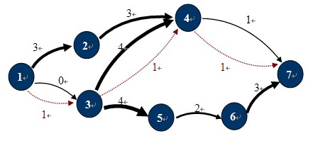
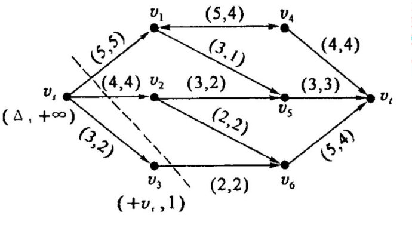

# 网络流

给定指定的一个有向图,其中有两个特殊的点**源S(Sources)**和汇**T(Sinks)**,每条边有指定的**容量(Capacity)**,求满足条件的从S到T的**最大流(MaxFlow)**.

网络流相关定义

1. 网络是一个有向带权图，包含一个源点和一个汇点，没反平行边
2. 网络流：即网络上的流，是定义在边集E上的一个非负函数$flow=\{flow(u,v)\}$,$flow(u,v)$是边上的流量
3. 可行流：满足**容量约束**和**流量守恒**的网络流
4. 网络最大流：满足**容量约束**和**流量守恒**的条件下，在流网络中找到一个净输出最大的网络流

最大流

求解最大流的整体思路是**福特福克森**算法。该算法的思想是：
在残余网络中找可增广路，然后在**实流网络**中沿着可增广路**增流**，在**残余网络**中沿着可增广路**减流**，；继续在残余网络中找可增广路。直到不存在可增广路位置。此时，实流网络中的可行流就是所求的最大流.

> 增广路定理：设$flow$是网络$G$的一个可行流，如果不存在从源点$S$到汇点$t$关于$flow$的可增广路$p$，则$flow$是$G$的一个最大流

福特福克森也是能算是一种求解最大流的思想，并不是具体的算法。下面说一下具体实现的算法。
实现的算法有三种:EK算法，Dinic算法，SAP算法+gap优化

最大流最小割定理

主要是理解一些概念

-   割:设Ci为网络N中一些弧的集合，若从N中删去Ci中的所有弧能使得从源点Vs到汇点Vt的路集为空集时，称Ci为Vs和Vt间的一个割。就是用一条线可以把一张有向图分割成两个不想交的集合，割的容量就是这一条线割到的边上的容量之和
-   最小割：图中所有的割中，边权值和最小的割为最小割。就是用一条线把一个图分成两个部分，使得边上所有容量的和最小,如下图最小割的容量为:5+4+2=11

-   最大流最小割定理:在任何的网络中，最大流的值等于最小割的容量。否则还可以增广。那么有一个特征:最小割个到的边的**容量**和**流量**相等。

