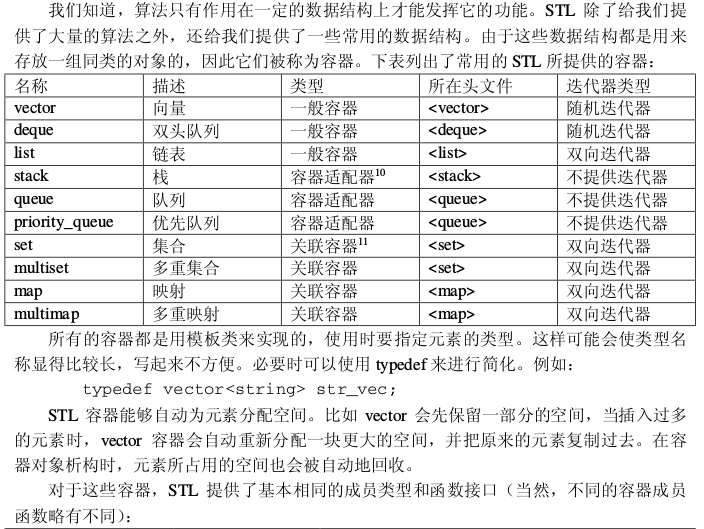
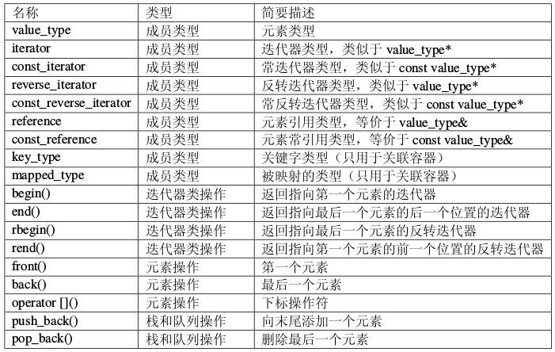
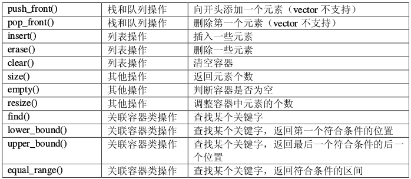

### 常用STL及用法

#### 哈希容器

```cpp
//当容器不需要排序时可以通过哈希容器来获取更高的性能
#include <unordered_map>
#include <unordered_set>
unordered_map<int,int>mp1;
unordered_multimap<int,int>mp2;
unordered_set<int>s1;
unordered_multiset<int>s2;
```

#### STL中的二分查找算法

-   binary_search：查找某个元素是否出现。
-   lower_bound：查找第一个大于或等于某个元素的位置。
-   upper_bound：查找第一个大于某个元素的位置。
-   equal_range：查找某个元素出现的起止位置。注意，终止位置为最后一次出现的位置加一。

1. `binary_search`试图在已排序的[first, last)中寻找元素value。如果[first, last)内有等价于value的元素，它会返回true，否则返回false，它不返回查找位置。

2. `lower_bound`它试图在已排序的[first,last)中寻找元素value。如果[first, last)具有等价于value的元素，lower_bound返回一个iterator指向其中第一个元素。如果没有这样的元素存在，它便返回假设这样的元素存在的话，会出现的位置。即指向第一个不小于value的元素。如果value大于[first, last)的任何一个元素，则返回last。

   ```cpp
   int main()  
   {  
       int point[10] = {1,3,7,7,9};  
       int tmp = upper_bound(point, point + 5, 7)- point;//按从小到大，7最多能插入数组point的哪个位置  
       printf("%d\n",tmp);  
       tmp = lower_bound(point, point + 5, 7) - point;////按从小到大，7最少能插入数组point的哪个位置  
       printf("%d\n",tmp);  
       return 0;  
   }  
   ```

3. `upper_bound`它试图在已排序的[first,last)中寻找value，返回可安插value的最后一个合适的位置。如果value存在，lower_bound 返回的是指向该元素的iterator。相较之下upper_bound并不这么做，它返回value可被安插的最后一个合适位置。如果value存在，那么它返回的iterator将指向value的下一个位置，而非value自身。

4. `equal_range`的返回值本质上结合了lower_bound和upper_bound两者的返回值。其返回值是一对iterator i 和 j ， 其中i是value可安插的第一个位置，j则是value可安插的最后一个位置。可以推演出：[i，j)中的每个元素都等价于value，而且[i, j)是[first, last)之中符合上述性质的一个最大子区间。  算法lower_bound返回该range的第一个iterator， 算法upper_bound返回该range的past-the-end iterator，算法equal_range则是以pair的形式将两者都返回。

#### unique去重

```cpp
int m=unique(X,X+num)-X;
```

上面的函数可以对一个数组进行去重，前提是数组已经有序，去重后返回最后一个元素的位置，其实并没有去，只是把重复的放在了后面

#### String类的一些用法

1.  `replace`的用法

    ```cpp
    /*用法一：  
     *用str替换指定字符串从起始位置pos开始长度为len的字符  
     *string& replace (size_t pos, size_t len, const string& str);  
     */    
    int main()    
    {    
        string line = "this@ is@ a test string!";    
        line = line.replace(line.find("@"), 1, ""); //从第一个@位置替换第一个@为空    
        cout << line << endl;       
        return 0;    
    }    

    /*用法二：  
     *用str替换 迭代器起始位置 和 结束位置 的字符  
     *string& replace (const_iterator i1, const_iterator i2, const string& str);  
     */    
    int main()    
    {    
        string line = "this@ is@ a test string!";    
        line = line.replace(line.begin(), line.begin()+6, "");  //用str替换从begin位置开始的6个字符    
        cout << line << endl;       
        return 0;    
    } 
    /*用法三：  
     *用substr的指定子串（给定起始位置和长度）替换从指定位置上的字符串  
     *string& replace (size_t pos, size_t len, const string& str, size_t subpos, size_t sublen);  
     */    
    int main()    
    {    
        string line = "this@ is@ a test string!";    
        string substr = "12345";    
        line = line.replace(0, 5, substr, substr.find("1"), 3); //用substr的指定子串（从1位置数共3个字符）替换从0到5位置上的line    
        cout << line << endl;       
        return 0;    
    } 
    ```

2. 常用方法
```cpp
a) =,assign()     //赋以新值  
b) swap()     //交换两个字符串的内容  
c) +=,append(),push_back() //在尾部添加字符  
d) insert() //插入字符  
e) erase() //删除字符  
f) clear() //删除全部字符  
g) replace() //替换字符  
h) + //串联字符串  
i) ==,!=,<,<=,>,>=,compare()    //比较字符串  
j) size(),length()    //返回字符数量  
k) max_size() //返回字符的可能最大个数  
l) empty()    //判断字符串是否为空  
m) capacity() //返回重新分配之前的字符容量  
n) reserve() //保留一定量内存以容纳一定数量的字符  
o) [ ], at() //存取单一字符  
p) >>,getline() //从stream读取某值  
q) <<    //将谋值写入stream  
r) copy() //将某值赋值为一个C_string  
s) c_str() //将内容以C_string返回  
t) data() //将内容以字符数组形式返回  
u) substr() //返回某个子字符串  
v)查找函数  
w)begin() end() //提供类似STL的迭代器支持  
x) rbegin() rend() //逆向迭代器  
y) get_allocator() //返回配置器  
```

```cpp
string s1;//默认构造函数，s1为空串
string s2(s1);//将s2初始化为s1的副本
string s1('abc');//将s1初始化为一个字符串面值副本
string s1(n,'w');//将s1初始化为'w'的n个副本
cin>>s1;//读取有效字符，遇到空格结束
getline(cin,s1);//读取字符直至遇到换行(可以读取空格)
getline(cin,s1,'w');//读取字符直至遇到字符'w'(可读取空格和换行)
s1.empty();//s1为空返回真，否则返回假
reverse(s1.begin(),s1.end());//将string对象迭代器指向的一段区间内元素反向排序
s1.size();//返回字符个数
s1.length();//同上，返回字符个数,一般不怎么用
s1[n];//返回位置为n的字符(从0开始计数)
s1.append("abc");//向字符串尾部添加字符串
s1+s2;//连接s1,s2两个字符串
/*可以把一个string对象和一个字符面值相连，但不能将两个字符面值相加。
s1+'w'+'y'这种相加是允许的。'w'+'y'+s1是错误的*/
s1=s2;//替换
s1==s2;//判断相等，相等返回真，否则返回假
```
string.find("字符串",起始位置):从起始位置开始搜索字符串，返回下标

## Set容器

```cpp
begin() 返回指向第一个元素的迭代器  
clear() 清除所有元素  
count() 返回某个值元素的个数  
empty() 如果集合为空，返回true(真）  
end() 返回指向最后一个元素之后的迭代器，不是最后一个元素  
equal_range() 返回集合中与给定值相等的上下限的两个迭代器  
erase() 删除集合中的元素  
find() 返回一个指向被查找到元素的迭代器  
get_allocator() 返回集合的分配器  
insert() 在集合中插入元素  
lower_bound() 返回指向大于（或等于）某值的第一个元素的迭代器  
key_comp() 返回一个用于元素间值比较的函数  
max_size() 返回集合能容纳的元素的最大限值  
rbegin() 返回指向集合中最后一个元素的反向迭代器  
rend() 返回指向集合中第一个元素的反向迭代器  
size() 集合中元素的数目  
swap() 交换两个集合变量  
upper_bound() 返回大于某个值元素的迭代器  
value_comp() 返回一个用于比较元素间的值的函数  
```

## 优先队列

>   普通的队列是一种先进先出的数据结构，元素在队列尾追加，而从队列头删除。在优先队列中，元素被赋予优先级。当访问元素时，具有最高优先级的元素最先删除。优先队列具有最高级先出 （first in, largest out）的行为特征。

```cpp
priority_queue<int,vector<int>,less<int>>s;//定义优先级队列s，less表示按照递减(从大到小)的顺序插入元素  
priority_queue<int,vector<int>,greater<int>>s;//定义优先级队列s，greater表示按照递增（从小到大）的顺序插入元素
//基本操作
empty(); 队列为空返回1  
pop();   出队  
push();  入队  
top();   返回队列中优先级最高的元素  
size();  返回队列中元素的个数  
//运算符重载
struct point{      
    int x;      
    int y;      
    int times;      
    friend bool operator < (point a, point b)      
    {      
        return a.times > b.times;    //重载小于号使得小的先出队列      
    }      
};   
```

## Vector容器

```cpp
//常用的vector方法：
1.push_back   在数组的最后添加一个数据  
2.pop_back    去掉数组的最后一个数据   
3.at                得到编号位置的数据  
4.begin           得到数组头的指针  
5.end             得到数组的最后一个单元+1的指针  
6．front        得到数组头的引用  
7.back            得到数组的最后一个单元的引用  
8.max_size     得到vector最大可以是多大  
9.capacity       当前vector分配的大小  
10.size           当前使用数据的大小  
11.resize         改变当前使用数据的大小，如果它比当前使用的大，者填充默认值  
12.reserve      改变当前vecotr所分配空间的大小  
13.erase         删除指针指向的数据项  
14.clear          清空当前的vector  
15.rbegin        将vector反转后的开始指针返回(其实就是原来的end-1)  
16.rend          将vector反转构的结束指针返回(其实就是原来的begin-1)  
17.empty        判断vector是否为空  
18.swap         与另一个vector交换数据  
---
c.clear()         移除容器中所有数据。  
c.empty()         判断容器是否为空。  
c.erase(pos)        删除pos位置的数据  
c.erase(beg,end) 删除[beg,end)区间的数据  
c.front()         传回第一个数据。  
c.insert(pos,elem)  在pos位置插入一个elem拷贝  
c.pop_back()     删除最后一个数据。  
c.push_back(elem) 在尾部加入一个数据。  
c.resize(num)     重新设置该容器的大小  
c.size()         回容器中实际数据的个数。  
c.begin()           返回指向容器第一个元素的迭代器  
c.end()             返回指向容器最后一个元素的迭代器  

```

## Pair容器

类模板：`template <class T1, class T2> struct pair`

参数：T1是第一个值的数据类型，T2是第二个值的数据类型。

功能：pair将一对值组合成一个值，这一对值可以具有不同的数据类型（T1和T2），两个值可以分别用pair的两个公有函数first和second访问。

具体用法：

```cpp
//1.定义（构造）：
pair<int, double> p1;  //使用默认构造函数  
pair<int, double> p2(1, 2.4);  //用给定值初始化  
pair<int, double> p3(p2);  //拷贝构造函数  
//2.访问两个元素（通过first和second）：
pair<int, double> p1;  //使用默认构造函数  
p1.first = 1;  
p1.second = 2.5;  
cout << p1.first << ' ' << p1.second << endl;  
//3.赋值operator = ：
//（1）利用make_pair：
pair<int, double> p1;  
p1 = make_pair(1, 1.2);  
//（2）变量间赋值：
pair<int, double> p1(1, 1.2);  
pair<int, double> p2 = p1;  
```

## 全排列函数next_permutation
生成1-8的全排列

```cpp
#include <bits/stdc++.h>
using namespace std;
int main()
{
    int num[8]= {1,2,3,4,5,6,7,8};
    do
    {
        for(int i=0; i<7; i++)
            printf("%d ",num[i]);
        printf("%d",num[7]);
        puts("");
    }
    while(next_permutation(num,num+8));
    return 0;
}
```

## 集合运算,求交集和并集

STL中有一个函数是：`set_difference（）`，作用是求两个集合的差。

set_difference()算法计算两个集合[start1, end1)和[start2, end2)的差集, 并将差集存放到result. 
两个集合以序列的形式给出, 且必须先按升序排好位置. 
set_difference()是一个指向result序列末尾的迭代器. 
如果严格弱排序的比较函数对象cmp未指定, set_difference()将使用<操作符比较元素.

具体用法请看C++官网介绍：[std::set_difference](http://www.cplusplus.com/reference/algorithm/set_difference/)

```cpp
#include <bits/stdc++.h>
using namespace std;
int a[110],b[110];
int main()
{
    int n,m;
    while(~scanf("%d%d",&n,&m)&&(m||n))
    {
        for(int i=0; i<n; i++)scanf("%d",&a[i]);
        for(int i=0; i<m; i++)scanf("%d",&b[i]);
        sort(a,a+n);
        sort(b,b+m);
        vector<int>v(110);
        vector<int>::iterator it;
        it=set_difference(a,a+n,b,b+m,v.begin());
        v.resize(it-v.begin());
        if(v.size()==0)puts("NULL");
        else
        {
            for(it=v.begin(); it!=v.end(); ++it)
                cout<<*it<<" ";
            cout<<endl;
        }
    }
    return 0;
}
```

其他函数:

```cpp
set_union():对两个有序序列进行集合并运算
set_intersection():对两个有序序列进行集合交运算
set_difference():对两个有序序列进行集合差运算
set_symmetric_difference():对两个有序序列进行集合对称差运算
```

## nth_element用法

头文件:`algorithm`

作用:把一个序列中第 n 小的元素放到它排序后的位置上(数组下标是从0开始的)

用法:`nth_element(开始位置，需要排第几的元素,结束位置)`

例子:

```cpp
//1.数组版
#include <bits/stdc++.h>
using namespace std;
int main()
{
    int a[]= {4,3,2,1,0};
    nth_element(a,a+2,a+5);//a数组中升序排列中第2小的元素(0,1,2)放在第2个位置
    for(int i=0; i<5; i++)
        printf("%d ",a[i]);
    //输出:0 1 2 4 3
    return 0;
}
//2. vector版
#include <bits/stdc++.h>
using namespace std;
int main()
{
    int a[]= {4,3,2,1,0};
    vector<int>b(a,a+5);
    nth_element(b.begin(),b.begin()+2,b.end());
    for(int i=0; i<5; i++)
        printf("%d ",b[i]);
    //输出:0 1 2 4 3
    return 0;
}
//3. 自定义比较函数
#include <bits/stdc++.h>
using namespace std;
bool cmp(int a,int b)//类似sort的比较函数，这是从大到小
{
    return a>b;
}
int main()
{
    int a[]= {4,3,2,1,0};
    vector<int>b(a,a+5);
    nth_element(b.begin(),b.begin()+4,b.end(),cmp);//从大到小的第4个(从0开始数)放在它的位置上
    for(int i=0; i<5; i++)
        printf("%d ",b[i]);
    //输出:2 3 4 1 0   
    return 0;
}
```


## STL中包含的函数
```bash
for_each() 对一个序列中的每个元素进行一项操作
find() 在一个序列中查找某个值第一次出现的位置
find_if() 在一个序列中查找第一个符合某个谓词的元素的位置
find_first_of() 在一个序列中查找另一个序列中的任意元素第一次出现的位置
adjacent_find() 在一个序列中查找第一对相邻且相等的元素的位置
count() 统计某个值在一个序列中出现的次数
count_if() 统计一个序列中符合某个谓词的元素的个数
mismatch() 查找两个序列中第一对相异元素的位置
equal() 判断两个序列是否完全相等
search() 在一个序列中查找某个子序列第一次出现的位置
find_end() 在一个序列中查找某个子序列最后一次出现的位置
search_n() 在一个序列中查找某个值连续出现 n 次的位置
transform() 对序列中的每个元素进行一项操作,并产生相应的输出序列
copy() 复制一个序列中的元素到另一个序列(从前往后)
copy_backward() 复制一个序列中的元素到另一个序列(从后往前)
swap() 交换两个元素的值
iter_swap() 交换两个迭代器所指向的元素的值
swap_ranges() 交换两个序列中的元素
replace() 把一个序列中的某个值替换成另一个值
replace_if() 把一个序列中符合某个谓词的元素替换成另一个值
replace_copy() 同 replace(),但结果输出到另一个序列
replace_copy_if() 同 replace_if(),但结果输出到另一个序列
fill() 把一个序列中的所有元素都填充为某个值
fill_n() 同 fill(),但用起始迭代器和序列长度来描述一个序列
generate() 把一个序列中的所有元素都填充为某个发生器的返回值
generate_n() 同 generate(),但用起始迭代器和序列长度来描述一个序列
remove() 删除一个序列中等于某个值的元素
remove_if() 删除一个序列中符合某个谓词的元素
remove_copy() 同 remove(),但结果输出到另一个序列
remove_copy_if() 同 remove_if(),但结果输出到另一个序列
unique() 删除一个序列中多余的相邻相等元素
unique_copy() 同 unique(),但结果输出到另一个序列
reverse() 反转一个序列
reverse_copy() 同 reverse(),但结果输出到另一个序列
rotate() 旋转一个序列
rotate_copy() 同 rotate(),同结果输出到另一个序列
random_shuffle() 随机打乱一个序列中各元素的位置
sort() 对一个序列中的元素进行排序
stable_sort() 同 sort(),但保证排序的稳定性
partial_sort() 对一个序列的前面部分元素进行排序
parital_sort_copy() 同 partial_sort(),但结果输出到另一个序列
nth_element() 把一个序列中第 n 小的元素放到它排序后的位置上
lower_bound() 在一个有序序列中二分查找某个值,返回第一次出现的位置
upper_bound() 在一个有序序列中二分查找某个值,返回最后一次出现的位置的后一个位置
equal_range() 在一个有序序列中二分查找某个值,返回所有与这个值相等的元素构成的子序列
binary_search() 在一个有序序列中二分查找某个值,返回这个值是否出现在这个序列中
merge() 合并两个有序序列
inplace_merge() 合并两个连续的有序序列
partition() 重新调整一个序列中所有元素的位置,使得符合某个谓词的元素被排在前面
stable_partition() 同 partition(),但保证调整的稳定性
includes() 判断一个序列是否为另一个序列的子序列(可以不连续)
set_union() 对两个有序序列进行集合并运算
set_intersection() 对两个有序序列进行集合交运算
set_difference() 对两个有序序列进行集合差运算
set_symmetric_difference() 对两个有序序列进行集合对称差运算
make_heap() 把一个序列调整为一个堆
push_heap() 向堆中插入一个元素
pop_heap() 从堆中提取堆顶的元素
sort_heap() 把一个堆调整为一个有序序列
min() 返回两个值中较小的值
max() 返回两个值中较大的值
min_element() 返回一个序列中最小的元素的位置
max_element() 返回一个序列中最大的元素的位置
lexicographical_compare() 按照字典次序比较两个序列
next_permutation() 返回字典次序中由一个序列中所有元素构成的下一个排列序列
prev_permutation() 返回字典次序中由一个序列中所有元素构成的上一个排列序列
accumulate() 计算一个序列中所有元素的和
inner_product() 计算两个序列的内积
partial_sum() 计算一个序列的部分和序列
adjacent_difference() 计算一个序列的相邻元素之差序列
```

## 容器的各种使用





>   1.  vector 就 是 一 个 智 能型 的 一 维数 组 , 能 够 自 动 调整 存 储 空间 。 vector 还 优 化 了vector<bool>的存储方式,用每一位来存储一个 bool。但是由于信息学竞赛中数据的规模一
>   般是给定的,再加上 vector 在调整存储空间时移动数据会花费较多的时间,因此在信息学
>   竞赛中 vector 并不是很实用。
>   2.  deque 是用指针数组来实现的,两头都留有一定的空间,因此首尾的插入/删除操作很
>   快。deque 一般用作容器适配器(stack、queue 等)的内置容器。
>   list 一般用双向链表来实现,可以使我们避免书写大量重复的链表基本操作,降低编程
>   复杂度。
>   3.  stack、queue、priority_queue 都是容器适配器。由于提供的接口函数较少,因此 stack
>   和 queue 的用处有所限制,但应付一般的情况都已经够用了。priority_queue 是一个用二叉
>   堆实现的优先队列,与一般队列的区别是在提取元素时,优先队列总是先提取最小的元素。
>   priority_queue 在做模拟题时非常有用,因为做模拟题的关键就是要处理好事件的先后次序。
>   我们可以把题目中的各种事件都作为对象,并按照题目中的规则赋予它们不同的优先级,
>   重载比较操作符。然后,我们把这些对象一一推入优先队列,再提取出来并一一加以处理
>   就可以了。另外,由于接口函数的限制,优先队列很难处理队列中的元素需要改变的情况
>   (例如 Dijkstra 算法、Prim 算法等)。
>   4.  STL 提供的关联容器功能十分强大。这四种关联容器都是用平衡二叉树(一般是红黑
>   树)来实现的。容器内的元素都是有序的,插入、删除、查找等操作都可以在 O(log n)的
>   时间内完成。set、multiset 中元素本身直接参与排序,或者说元素本身就是关键字;而 map、
>   multimap 中只有关键字参与排序,被映射的值只作为周围数据存在,并且可以被修改。另
>   外,set、map 中不能出现相等的关键字,而 multiset、multimap 则允许出现相等的关键字。
>   这些关联容器都可以通过关键字来查找元素。进行查找操作的成员函数有 find()、
>   lower_bound()、upper_bound()、equal_range()等。在没有找到要求查找的关键字时,find()
>   返回成员函数 end()的返回值以表示失败,而其他三个函数的返回值则与<algorithm>中的同
>   名函数相似。此外,由于 map 中的关键字和被映射的值是一一对应的,因此 map 类重载了
>   下标运算符,使得元素的访问变得更加方便

### 高效位运算 __builtin_系列函数
1. int __builtin_ffs (unsigned int x) 
     返回x的最后一位1的是从后向前第几位，比如7368（1110011001000）返回4。 
2. int __builtin_clz (unsigned int x) 
     返回前导的0的个数。 
3. int __builtin_ctz (unsigned int x) 
     返回后面的0个个数，和__builtin_clz相对。 
4. int __builtin_popcount (unsigned int x) 
     返回二进制表示中1的个数。 
5. int __builtin_parity (unsigned int x) 
     返回x的奇偶校验位，也就是x的1的个数模2的结果。
     

此外，这些函数都有相应的usigned long和usigned long long版本，只需要在函数名后面加上l或ll就可以了，比如int __builtin_clzll。