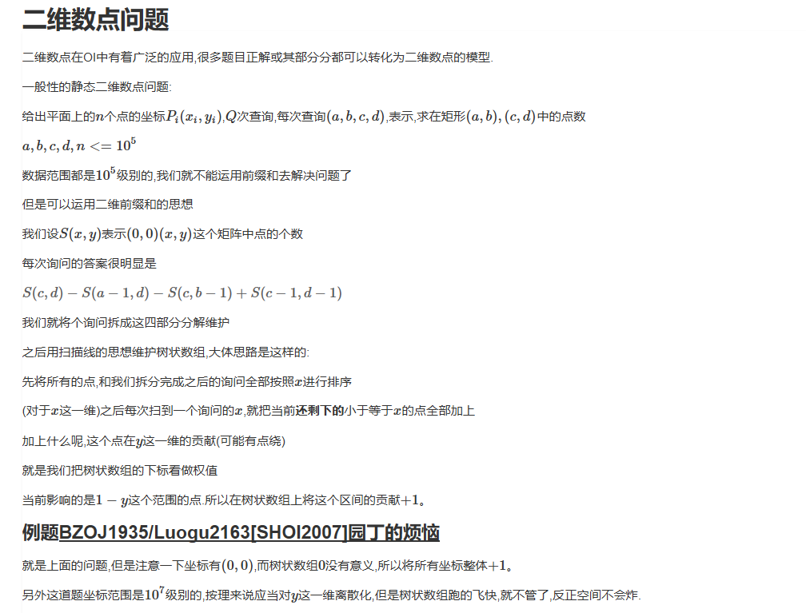

# 二维数点




# 代码

```c++
#include <bits/stdc++.h>
using namespace std;
const int maxn = 5e5+5;
int c[10000003];
int n, m, ans[maxn];
struct node{
    int x, y;
}v[maxn];
struct ques{
    int x, y, id, opt;
    ques(){}
    ques(int x_, int y_, int id_, int opt_):x(x_),y(y_),id(id_),opt(opt_){}
}q[maxn<<2];
inline bool cmp1(node x, node y){
    return x.x < y.x;
}
inline bool cmp2(ques x, ques y){
    return x.x < y.x;
}
inline void update(int x, int val){
    for(; x<=n; x+=x&-x) c[x] += val;
}
inline int query(int x){
    int res=0;
    for(; x; x-=x&-x) res += c[x];
    return res;
}
int main(){
    int cnt=0;
    scanf("%d%d", &n,&m);
    for(int i=1; i<=n; i++) scanf("%d%d", &v[i].x,&v[i].y);
    for(int i=1; i<=n; i++) v[i].x+=1,v[i].y+=1;
    for(int i=1; i<=m; i++){
        int x1, y1, x2, y2;
        scanf("%d%d%d%d", &x1,&y1,&x2,&y2);
        x1++,y1++,x2++,y2++;
        q[++cnt] = ques(x2,y2,i,1);
        q[++cnt] = ques(x1-1,y2,i,-1);
        q[++cnt] = ques(x2,y1-1,i,-1);
        q[++cnt] = ques(x1-1,y1-1,i,1);
    }
    sort(v+1, v+n+1, cmp1);
    sort(q+1, q+cnt+1, cmp2);
    int now=1;
    for(int i=1; i<=cnt; i++){
        while(v[now].x <= q[i].x && now <= n) update(v[now].y, 1), now++;
        ans[q[i].id] += q[i].opt * query(q[i].y);
    }
    for(int i=1; i<=m; i++) printf("%d\n", ans[i]);
    return 0;
}
```

