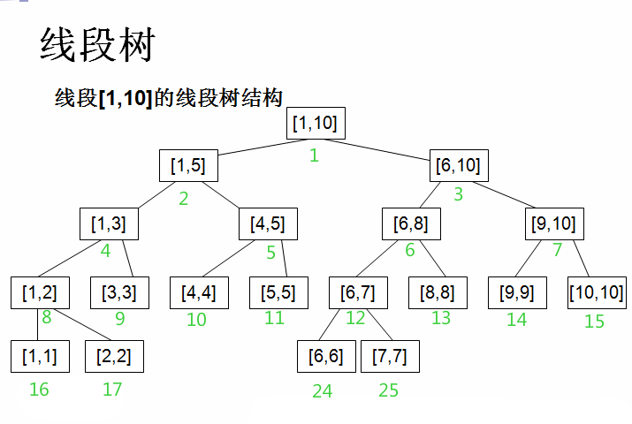

# 线段树

线段树，也叫区间树，是一个完全二叉树，它在各个节点保存一条线段（即“子数组”），因而常用于解决数列维护问题，它基本能保证每个操作的复杂度为`O(nlogn)`。

他大概长这样子：

上面的标号代表每个节点的标号，把一段区间利用这种方式可以实现O(lgN)的时间复杂度。

要建立线段树，先说一下我的线段树的风格(HH大牛的风格)：

-   maxn是题目给的最大区间,而节点数要开4倍,确切的来说节点数要开大于maxn的最小2^x的两倍
-   lson和rson分辨表示结点的左儿子和右儿子,由于每次传参数的时候都固定是这几个变量,所以可以用预定于比较方便的表示
-   以前的写法是另外开两个个数组记录每个结点所表示的区间,其实这个区间不必保存,一边算一边传下去就行,只需要写函数的时候多两个参数,结合lson和rson的预定义可以很方便
-   PushUP(int rt)是把当前结点的信息更新到父结点
-   PushDown(int rt)是把当前结点的信息更新给儿子结点
-   rt表示当前子树的根(root),也就是当前所在的结点

区间更新是指更新某个区间内的叶子节点的值，因为涉及到的叶子节点不止一个，而叶子节点会影响其相应的非叶父节点，那么回溯需要更新的非叶子节点也会有很多，如果一次性更新完，操作的时间复杂度肯定不是O(logn)，例如当我们要更新区间[0,3]内的叶子节点时，需要更新出了叶子节点3,9外的所有其他节点。为此引入了线段树中的延迟标记概念，这也是线段树的精华所在。

延迟标记：每个节点新增加一个标记，记录这个节点是否进行了某种修改(这种修改操作会影响其子节点)，对于任意区间的修改，我们先按照区间查询的方式将其划分成线段树中的节点，然后修改这些节点的信息，并给这些节点标记上代表这种修改操作的标记。在修改和查询的时候，如果我们到了一个节点p，并且决定考虑其子节点，那么我们就要看节点p是否被标记，如果有，就要按照标记修改其子节点的信息，并且给子节点都标上相同的标记，同时消掉节点p的标记。
