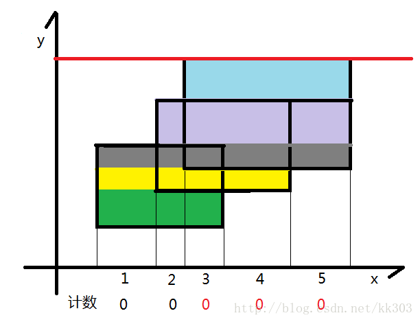

# 扫描线-离散化-矩形面积并

给了n个矩形，每个矩形给了左上角和右下角的坐标，矩形可能会重叠，求的是矩形最后的面积




-   如图所示，我们可以把整个矩形分成如图各个颜色不同的小矩形，那么这个小矩形的高就是我们扫过的距离，那么剩下了一个变量，那就是矩形的长一直在变化。
-   我们的线段树就是为了维护矩形的长，我们给每一个矩形的上下边进行标记，下面的边标记为1，上面的边标记为-1，每遇到一个矩形时，我们知道了标记为1的边，我们就加进来这一条矩形的长，等到扫描到-1时，证明这一条边需要删除，就删去，利用1和-1可以轻松的到这种状态。
-   还要注意这里的线段树指的并不是线段的一个端点，而指的是一个区间，所以我们要计算的时候r+1和r-1
-   再提一下离散化，离散化就是把一段很大的区间映射到一个小区间内，这样会节省大量空间，要进行离散化，我们先对端点进行排序，然后去重，然后二分找值就可以了

[POJ1151 Atlantis（线段树，扫描线，离散化，矩形面积并）](http://blog.csdn.net/riba2534/article/details/76851233)

```cpp
#define mem(a,b) memset(a,b,sizeof(a))
#define inf 0x3f3f3f3f
#define N 220
#define ll long long
using namespace std;
#define lson l,m,rt<<1
#define rson m+1,r,rt<<1|1
struct Seg
{
    double l,r,h;
    int f;
    Seg() {}
    Seg(double a,double b,double c,int d):l(a),r(b),h(c),f(d) {}
    bool operator < (const Seg &cmp) const
    {
        return h<cmp.h;
    }
} e[N];
struct node
{
    int cnt;
    double len;
} t[N<<2];
double X[N];
void pushdown(int l,int r,int rt)
{
    if(t[rt].cnt)//当前的边被标记，就把当前的长度加上
        t[rt].len=X[r+1]-X[l];
    else if(l==r)//当为一个点的时候长度为0
        t[rt].len=0;
    else//其他情况把左右两个区间的值加上
        t[rt].len=t[rt<<1].len+t[rt<<1|1].len;
}
void update(int L,int R,int l,int r,int rt,int val)
{
    if(L<=l&&r<=R)
    {
        t[rt].cnt+=val;//加上标记的值
        pushdown(l,r,rt);//像下更新节点
        return;
    }
    int m=(l+r)>>1;
    if(L<=m) update(L,R,lson,val);
    if(R>m) update(L,R,rson,val);
    pushdown(l,r,rt);
}
int main()
{
    int n,q=1;
    double a,b,c,d;
    while(~scanf("%d",&n)&&n)
    {
        mem(t,0);
        int num=0;
        for(int i=0; i<n; i++)
        {
            scanf("%lf%lf%lf%lf",&a,&b,&c,&d);
            X[num]=a;
            e[num++]=Seg(a,c,b,1);//矩形下面用1来标记吗
            X[num]=c;
            e[num++]=Seg(a,c,d,-1);//上面用-1来标记
        }
        sort(X,X+num);//用于离散化
        sort(e,e+num);//把矩形的边的纵坐标从小到大排序
        int m=unique(X,X+num)-X;
        double ans=0;
        for(int i=0; i<num; i++)
        {
            int l=lower_bound(X,X+m,e[i].l)-X;//找出离散化以后的值
            int r=lower_bound(X,X+m,e[i].r)-X-1;
            update(l,r,0,m,1,e[i].f);
            ans+=t[1].len*(e[i+1].h-e[i].h);
        }
        printf("Test case #%d\nTotal explored area: %.2lf\n\n",q++,ans);
    }
    return 0;
}
```

