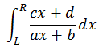

# 自适应辛普森积分

计算积分



结果保留至小数点后6位。

数据保证计算过程中分母不为0且积分能够收敛。

```cpp
#include <bits/stdc++.h>
double a,b,c,d,l,r;
inline double f(double x) {
    return (c*x+d)/(a*x+b);       //原函数
}
inline double simpson(double l,double r) {      //Simpson公式
    double mid=(l+r)/2;
    return (f(l)+4*f(mid)+f(r))*(r-l)/6;
}
double asr(double l,double r,double eps,double ans) {
    double mid=(l+r)/2;
    double l_=simpson(l,mid),r_=simpson(mid,r);
    if(fabs(l_+r_-ans)<=15*eps) return l_+r_+(l_+r_-ans)/15;     //确认精度
    return asr(l,mid,eps/2,l_)+asr(mid,r,eps/2,r_);     //精度不够则递归调用
}
inline double asr(double l,double r,double eps) {
    return asr(l,r,eps,simpson(l,r));
}
int main() {
    scanf("%lf%lf%lf%lf%lf%lf",&a,&b,&c,&d,&l,&r);
    printf("%.6lf",asr(l,r,1e-6));
    return 0;
}
```
模板2:
```cpp
const double eps = 1e-6;    //  积分精度
//  被积函数
double F(double x)
{
    double ans;
    //  被积函数
    //  ...
//    ans = x * exp(x);       //  椭圆为例
    return ans;
}
//  三点simpson法，这里要求F是一个全局函数
double simpson(double a, double b)
{
    double c = a + (b - a) / 2;
    return (F(a) + 4 * F(c) + F(b)) * (b - a) / 6;
}
//  自适应simpson公式（递归过程），已知整个区间[a, b]上的三点simpson指A
double asr(double a, double b, double eps, double A)
{
    double c = a + (b - a) / 2;
    double L = simpson(a, c), R = simpson(c, b);
    if (fabs(L + R - A) <= 15 * eps)
    {
        return L + R + (L + R - A) / 15.0;
    }
    return asr(a, c, eps / 2, L) + asr(c, b, eps / 2, R);
}
//  自适应simpson公式（主过程）
double asr(double a, double b, double eps)
{
    return asr(a, b, eps, simpson(a, b));
}
int main(int argc, const char * argv[])
{
//    std::cout << asr(1, 2, eps) << '\n';
    return 0;
}
```

